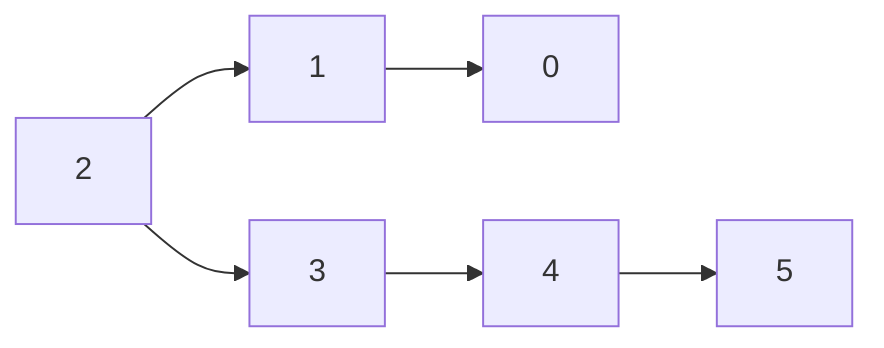
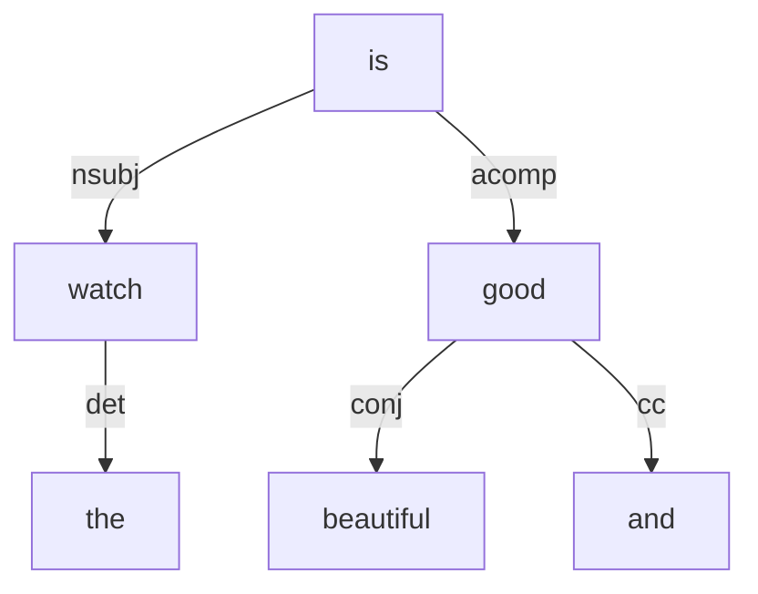

# Auszieher
社媒评论数据观点抽取


### 背景介绍

评论表达方式多样性：

1. watch is good；

2. I love that the watch has app；

3. the watch not work；

4. the watch works well；

5. One thing I like is the watch；

从上面例子中可以看出之前简单**基于情感词进行触发，并依据依存规则进行抽取**的方案无法满足所有句式；因此需要设计一种统一的适配性强的规则抽取方案；


### 设计思路

#### 抽取匹配

​    基于规则进行抽取无非就是充分利用 POS，DEP，lemma(text) 等这些token相关的特征，并基于这些特征属性构建连接(跳转)关系，因此可以使用有限状态自动机来实现匹配逻辑。Spacy 中的[DependencyMatcher](https://spacy.io/api/dependencymatcher)内部就是使用的FST原理来实现的。另外spacy的DependencyMatcher中还实现了[Semgrex operators](https://nlp.stanford.edu/nlp/javadoc/javanlp/edu/stanford/nlp/semgraph/semgrex/SemgrexPattern.html)多种操作符，可以方便我们灵活处理多种匹配运算。基于这些原因我们直接选择使用DependencyMatcher作为我们规则匹配引擎。

​    从文本中通过规则进行抽取首先要解决的就是规则触发问题，只有规则触发生效才能进行后续匹配处理。在进行匹配过程中不同的表达方式(句式)其实匹配跳转操作过程是统一的，无非是跳转条件的区别及复杂性不同而已。真正不同的是触发过程的不一致，如何设计触发过程统一化或者实现灵活配置会比较重要；

​    由于在用户评论抽取场景中表述句式复杂多样，要实现统一化比较困难，因此这里设计为灵活配置的方式进行处理。具体实现方案参考register注册机制，不同的句式可以定义不同的anchor函数，注册添加自动生效；

##### 问题难点：

+ 并列问题处理
+ 否定修饰处理
+ 一对多问题
  + 一个观点命中多个规则：如何选择最优
  + 一个规则命中多个抽取结果：结果是否融合
+ 目标确定：Holder, Emotion, Object, Reason
+ 固定词组/专有复合词自动补全

#### 情感计算

​    对于情感计算问题，之前的方式是通过情感词及否定词直接输出相关极性值的，这种处理方式简单但是泛化性及语义准确性不足。考虑这些问题我们此处在计算观点情感值上融合了抽取结果语义情感极性特征，情感词及否定词；

​    另外对于功能描述性的评论表述，如：not work，由于这种描述本身是不含极性意义的，因为在特定的场景下才有了情感值。为此我们增加了一个anchor type [用来表示描述或者匹配句式]来处理，通过anchor type来定义具体的默认情感值；


### 系统框架


#### 模块说明

##### online

+ TokenParser: 文本token处理及extension 设置，包含Token及Doc级别；
+ PhraseParser: 固定词组/专有复合词识别抽取；
+ Matcher:  规则匹配引擎；
+ Extractor: 匹配结果中目标信息抽取；
+ SentScore: 情感极性值计算；

##### offline

+ PatternParser: 规则解析器；


### 规则定义

#### 规则模板

为了便于规则定义、编辑以及后期对目标信息抽取，模板自动化生成等，我们需要确定好规则模板的形式；

##### 匹配单元结构定义

```
<(id1), (id2, dep, pos1|pos2|!pos3, lemma, type)>,<(), ()>
```

字段说明：

+ id: 单元索引
+ dep: 依存关系    
+ pos: 词性特征 
+ lemma: 词干表示    
+ type: 元素类别 (H:holder, E:emotion, O:object, R:reason, P:placeholder)

> 所有字段可以(不)包含多个值，使用`|`进行拼接

##### 匹配单元组织逻辑

在一个匹配单元中，如果**已知节点在前**则使用 `>` (to child) 操作，反之使用 `<` (to parent) 操作；

e.g.:

```
<(1,,NOUN,thing,N), (0)><(2,,AUX,be,N), (1)><(2), (3,attr,,,O)><(3), (4,prep,,,O)><(4), (5,pobj|amod,,,O)>
```



##### 规则检查

+ 节点ID必须从小到大, 0表示anchor节点(必须);
+ 在匹配单元中`<(),()>`必须包含一个新节点ID和一个一定有的节点ID;

##### 简单示例

```
# The watch is good and beautiful.
规则：<(1,,AUX,be,O),(0)><(1),(2,nsubj,NOUN,,A)>
good: 0
is  : 1
watch:2
并列关系：good & beautiful
```



#### 规则解析

​    由于规则模板定义的pattern并不能直接被规则引擎所使用，必须将其解析成固定的语法格式。我们系统中使用的规则匹配引擎是基于Spacy中的内置的**DependencyMatcher**来处理的，所以我们将我们定义的规则模板转换为其指定的语法格式：

```json
[{
  "RIGHT_ID": 0, 
  "RIGHT_ATTRS": {"_": {"anchor": true}}
	}, 
 {"LEFT_ID": 0, 
  "REL_OP": "<", 
  "RIGHT_ID": 1, 
  "RIGHT_ATTRS": {"POS": "AUX", "LEMMA": "be"}
 	}, 
 {"LEFT_ID": 1, 
  "REL_OP": ">", 
  "RIGHT_ID": 2, 
  "RIGHT_ATTRS": {"DEP": "nsubj", "POS": "NOUN"}
 	}
]
```


### 工程实现
+ `pattern_parser`:
	> 将规则模板编译成引擎处理格式，包含用户自定义的抽取规则及宏定义规则；
	
	
	
+ `token_parser`:
	> 将文本转化为doc结构，同时确定正确的 anchor(锚点) 位置；(用户也可以对认为不正确的anchor进行强制更改)
	
	
	
+ `phrase_parser`:
	
	> 组合词，并列关系词，常见组合结构等词组抽取，用于后面结果自动补全；
	
	实现难点：
	1. 有效并列关系抽取(`conj`)，(距离定义：当前token与其并列依存关系token之间的词长度间隔):
	
	   + 短距离(<=3)：直接使用；
	   + 长距离((3,8)):  需满足词性相同，并且有相同的子节点依存关系；
	   + 超长距离(>=8): 直接过滤；
	
	   另外，不管距离如何，有效并列关系必须是有意义的词性(VERB, NOUN, ADJ, AUX, PROPN)；
	
	2. 自定义组合词抽取：使用 phrase trie 处理；
	
	3. 常见词性组合词定义：
	
	   + VERB + NOUN: charging performance；


+ `pattern_matcher`:

  > 规则匹配，包含用户自定义业务抽取规则及系统定义宏规则；

  系统宏规则：

  + prep+pobj；
  + prep+prep+pobj；

  

+ `extractor`:
  > 对匹配结果进行结构化解析;

  实现难点：

  1. 匹配规则结果合并；

     在实际运行中会出现一个规则命中多个结果的现象，这些结果可以通过不同情况进行不同处理

     + 当两个结果有交集，并且这两个结果对应的差异值中最小值与最大值的距离小于3，则两个结果进行合并(在合并过程中要注意对应的etype进行合并)；
     + 否则不合并；

  2. 并列关系结果扩充；

     如果命中结果中包含有并列关系根节点(ConjRootUnit)，则需要依据并列关系进行适当扩充；

     + 如果并列节点与其对应的根节点距离L<=3 直接进行替换扩充；
     + 如果距离较大(3<L<8)，则根据匹配结果过程(即pattern_trace)获取并列关系根节点子节点依存匹配路径，再依据该匹配路径抽取替换结果，并进行替换扩充；
     + 否则不扩充；

  3. 结果补全；

  4. 后置处理：否定判断，结果排序；

  

+ `sent_score`:

  > 情感极性及强度值计算；

  1. 情感值计算方案：

     

     **step 1:** 使用通用情感模型计算抽取结果情感值 model_score，通用情感模型有：spacy_sentiment、stanza_sentiment，最终结果为两个模型中的最大值，如果值>0.85，则sent_score 即为该值，并直接返回结果，否则执行step 2；

     **step 2: **对 anchor进行处理：

     ​	I. 如果 anchor_sent !=0：

     ​                   $$\_sent\_score = (-1)^{否定词个数} * anchor\_sent$$

        II. 如果 anchor_type_sent != 0:

     ​                   $$\_sent\_score = anchor\_type\_sent$$

     **step 3: **计算命中结果中对应的所有情感词的情感极性值之和和 ass_score；

     **step 4:** 计算最终sent_score，并返回结果；

     ​                  $$sent\_score = 0.7*\_sent\_score + 0.1*\frac{ass\_score}{len(情感词个数)} + 0.2*model\_score$$

  2. 强度值计算方案：

     默认初始强度值为1，遍历匹配结果中的token，如果token存在程度词修饰关系节点，则强度值乘以该节点对应的程度系数，并以该节点为根节点递归查找其对应的程度词修饰节点，直至结束；

     伪代码：

     > 说明：$TOKENS$ 表示匹配结果token 集合，$DEGREEHEADDICT$  表示与程度词具有依存关系的映射集合；

     

+ `postprocess`:

  > 后置处理，例如过滤用户定义的无意义结果，或者更改对应的情感值；

#### 项目依赖:
+ spacy
+ stanza: 代码修改(stanza/models/classifiers/cnn_classifier.py:459)
